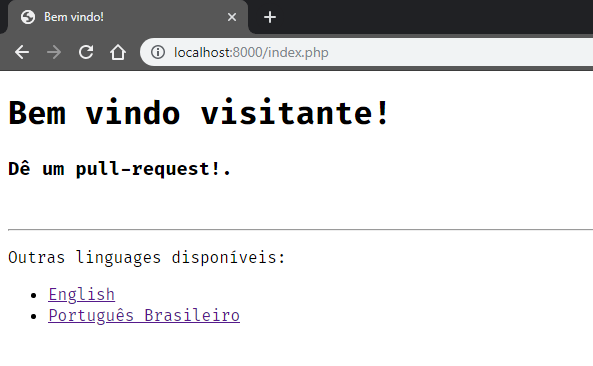
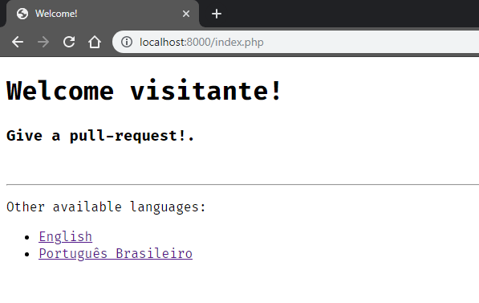
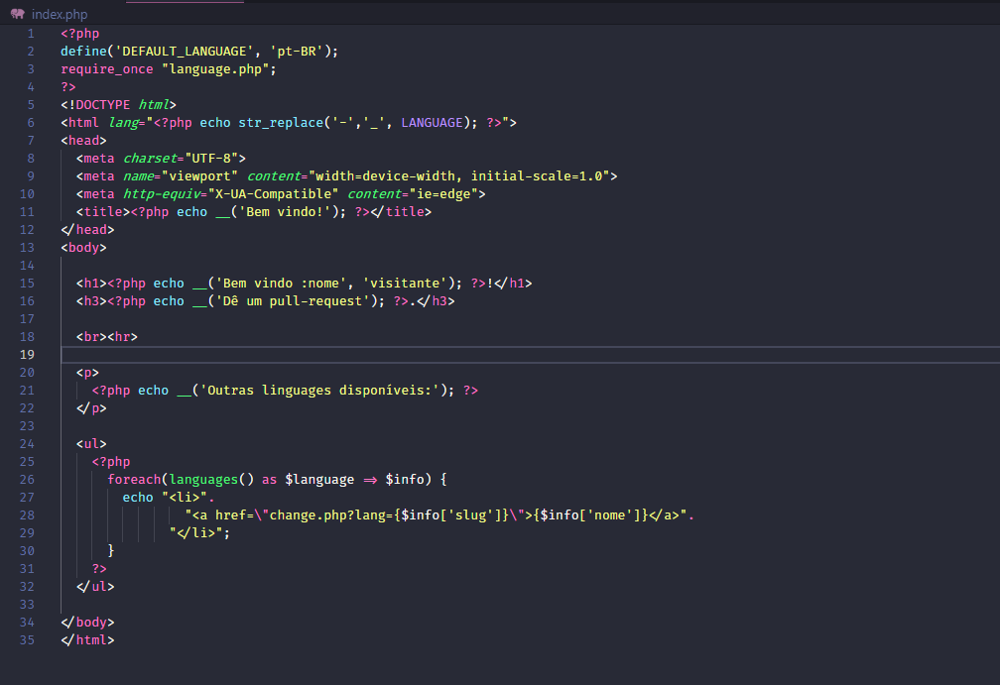

# teed-languages

Este é mais um experimento do que poderia ser feito quando o assunto é internacionalização de sites.

Não é a melhor forma de se fazer, mas é uma forma que encontrei.

Fork e adicione um pull-request ao projeto!

---

##### screenshots

*Mostrando linguagem default:*

*Selecionando linguagem inglês:*

*Configuração simples da home:*

